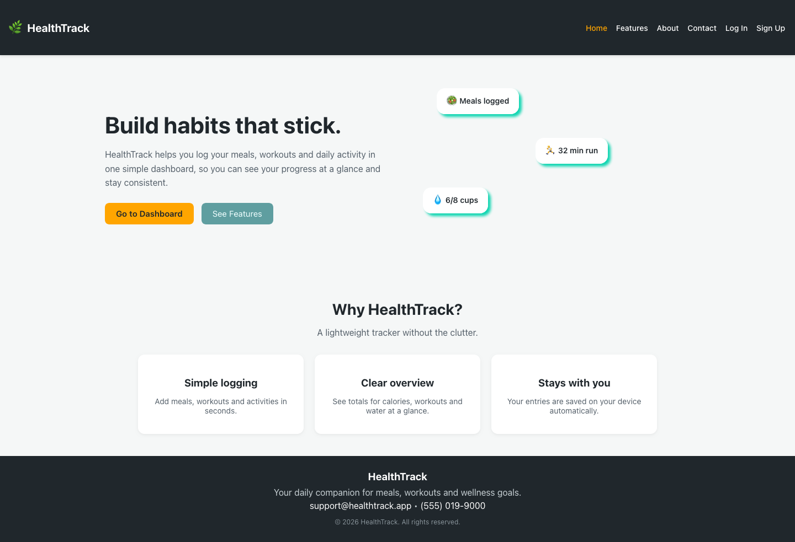
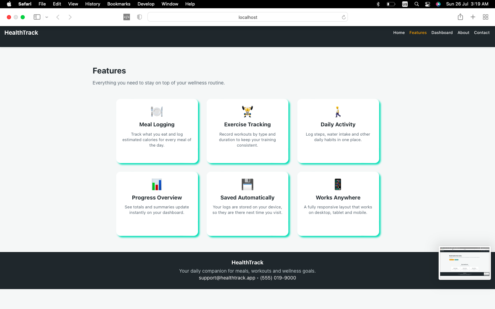
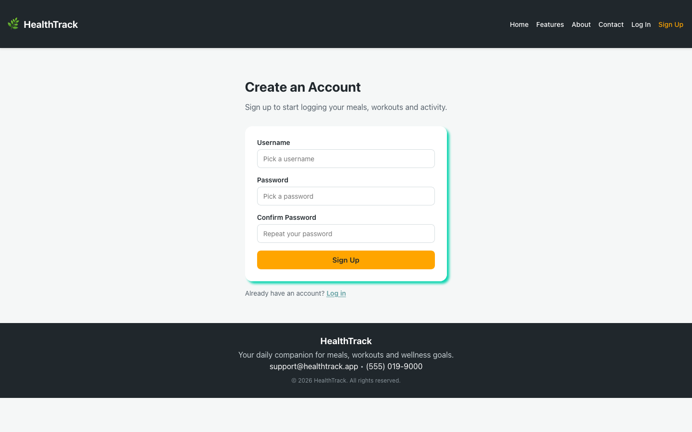
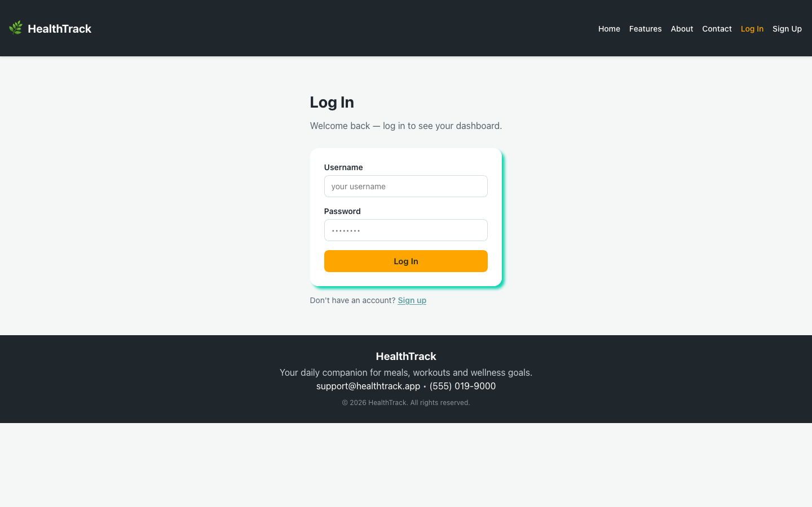
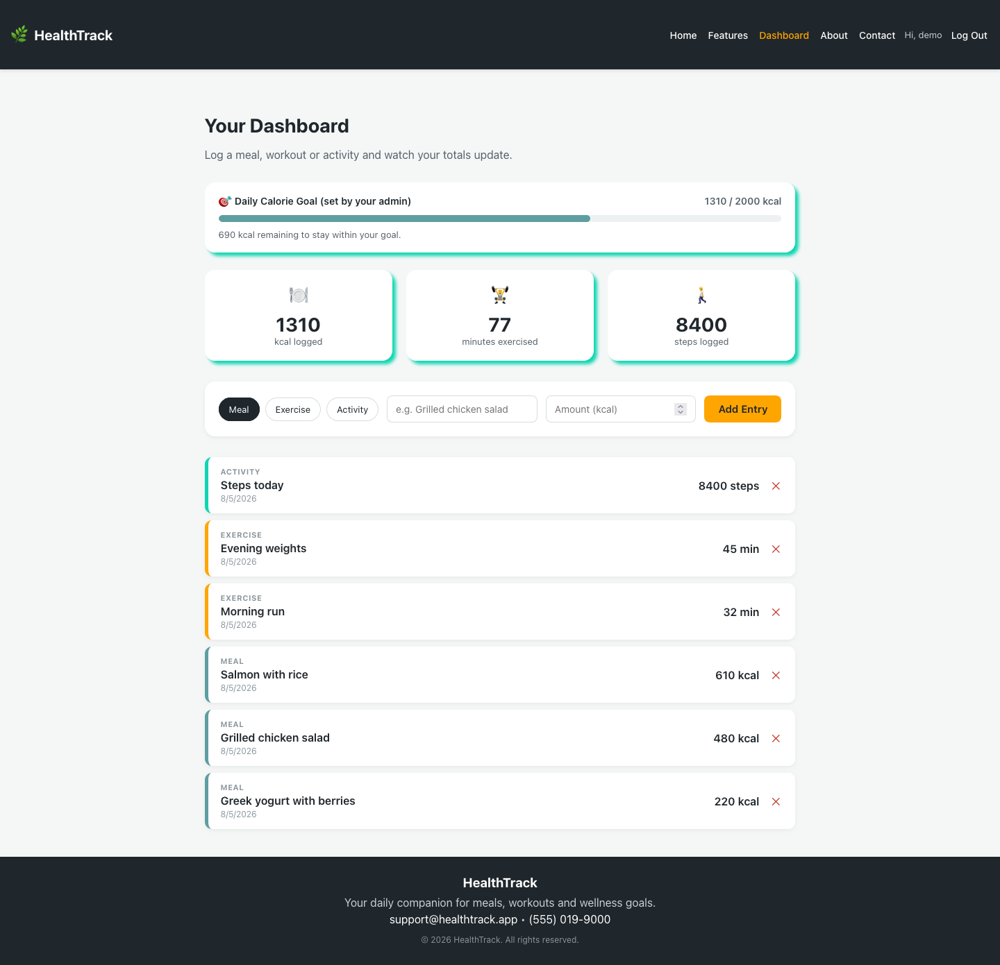
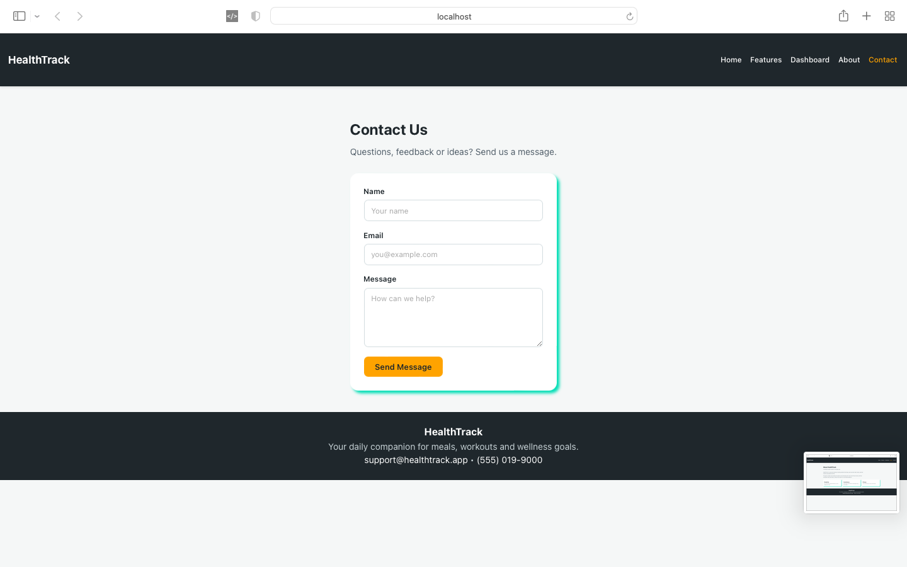
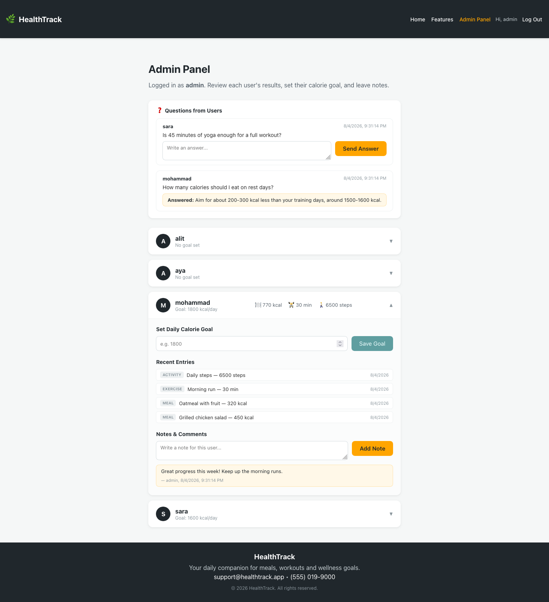
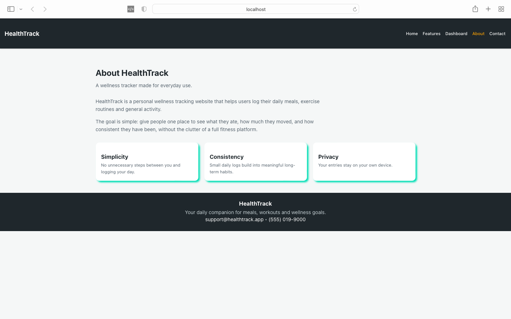

# HealthTrack

**🌐 Live demo: <https://health-track-indol-iota.vercel.app>**

A personal wellness tracking web application. Users sign up, log daily
meals, exercise sessions and general activity, and see their totals update
instantly on a dashboard. Admins can view every user's results, set each
user's daily calorie goal, leave notes, and answer questions submitted from
the Contact page.

> **Trying the demo?** The API is hosted on a free tier that sleeps after
> ~15 minutes of inactivity, so the very first request can take up to a
> minute to wake it. Everything is instant after that.
>
> Sign up for your own account, or log in as `admin` / `admin123` to see
> the Admin Panel.

**Deployed as:** React frontend on Vercel → Express API on Render → MySQL
on Railway.

Built for CSCI426 – Advanced Web Programming.
- **Phase 1**: React frontend (UI, pages, client-side state)
- **Phase 2**: Node.js + Express + MySQL backend, real authentication, deployed API

## Project Description

HealthTrack is a full-stack wellness tracker. The React frontend talks to a
Node.js/Express REST API, which stores everything in a MySQL database:
user accounts (with hashed passwords), daily meal/exercise/activity entries,
admin notes about each user, and a Q&A thread between users and the admin.

## Tech Stack

**Frontend**
- React 18 (Create React App)
- Plain CSS (no external UI framework)
- Page navigation via component state in `App.js` (no router library)

**Backend**
- Node.js + Express
- MySQL (via `mysql2`)
- `bcryptjs` for password hashing
- `jsonwebtoken` (JWT) for login sessions
- `cors`, `dotenv`

## Pages

| Page | Description |
|------|-------------|
| Home | Landing page with a hero section and value highlights |
| Features | Overview of what the app can do, shown as cards |
| Login / Signup | Create a real account or log in (backend-verified) |
| Dashboard (user-only) | Log meals/exercise/activity, see live totals and your admin-set calorie goal, delete entries |
| Admin Panel (admin-only) | View every user's logged totals and entries, set each user's daily calorie goal, add notes, and answer user questions |
| Contact | Ask the admin a question (must be logged in); see the admin's answer once posted |
| About | Information about the project |

## Database Schema

Two core related entities (plus two supporting ones), all linked by foreign key:

- **users** — `id, username, password (hashed), role, calorie_goal`
- **entries** — `id, user_id → users.id, type, name, value, unit, created_at`
- **notes** — `id, user_id → users.id, author, text, created_at`
- **questions** — `id, user_id → users.id, username, question, answer, answered_by, created_at`

Full definitions are in [`backend/schema.sql`](./backend/schema.sql).

## Setup Instructions

### 1. Prerequisites
- [Node.js](https://nodejs.org) v16+ and npm
- A MySQL database (local MySQL install, or a MySQL instance on Render)

### 2. Backend setup

```bash
cd backend
npm install
cp .env.example .env
```

Edit `.env` with your real database credentials and a random `JWT_SECRET`.

Create the database tables:

```bash
mysql -u root -p < schema.sql
```

Seed the admin account (creates the `admin` user with the password from
`ADMIN_PASSWORD`, or `admin123` if you left that unset locally):

```bash
npm run seed:admin
```

Run the backend:

```bash
npm run dev
```

The API runs at `http://localhost:5000` by default.

### 3. Frontend setup

From the project root (not the `backend` folder):

```bash
npm install
cp .env.example .env
```

`.env` should point at your backend, e.g. `REACT_APP_API_URL=http://localhost:5000/api`
for local development.

```bash
npm start
```

The app opens at [http://localhost:3000](http://localhost:3000).

## Accounts & Admin Access

Real accounts now live in MySQL, with passwords hashed using bcrypt — this
replaces the Phase 1 `localStorage` simulation.

- Anyone can **sign up** from the Sign Up page. Signups are always created
  as regular users — there is no way to create an admin through the UI.
- The admin account is created once via `npm run seed:admin` in the backend:
  - Username: `admin`
  - Password: whatever `ADMIN_PASSWORD` is set to in `backend/.env`
    (falls back to `admin123` locally if unset — never deploy with that).
- Logging in as `admin` shows the **Admin Panel** link instead of Dashboard.

## Deploying

Three pieces get hosted separately: the MySQL database, the Express API,
and the React static site.

**1. Database (MySQL)**

Render does *not* offer managed MySQL (only PostgreSQL), so the database
needs its own host — Railway, Aiven, or any cPanel/phpMyAdmin host all
work. Once it exists, run `schema.sql` against it, then seed the admin by
pointing your local `backend/.env` at the remote database and running
`npm run seed:admin`. Set `ADMIN_PASSWORD` in `.env` first, otherwise the
account is created with the well-known default password.

**2. Backend (Render)**
1. Push this repo to GitHub.
2. On [Render](https://render.com), create a **Web Service**, point it at
   this repo, and set the **Root Directory** to `backend`.
3. Build command: `npm install`. Start command: `npm start`.
4. Add these environment variables in Render's dashboard: `DB_HOST`,
   `DB_USER`, `DB_PASSWORD`, `DB_NAME`, `DB_PORT`, `DB_SSL=true`,
   `JWT_SECRET` (generate a fresh one — do not reuse the local value),
   and `CORS_ORIGIN`. Leave `PORT` unset; Render provides it.
5. Set `CORS_ORIGIN` to the frontend's URL from step 3, then redeploy.
   If it does not match exactly, every request fails in the browser with
   a generic "Load failed" error while the API itself works fine.

**3. Frontend (Vercel / Netlify / GitHub Pages)**
1. Import the repo, leaving the root directory as the project root —
   Create React App is detected automatically.
2. Set `REACT_APP_API_URL` to your deployed backend URL
   (e.g. `https://healthtrack-backend.onrender.com/api`).
   Note that Create React App bakes this in **at build time**, so changing
   it later requires a fresh build, not just a restart.
3. Deploying manually instead? Run `npm run build` and upload `build/`.

Note: Render's free tier sleeps after ~15 minutes of inactivity, so the
first request after a pause can take up to a minute to respond.

## Project Structure

```
healthtrack/
├── backend/
│   ├── config/db.js
│   ├── middleware/auth.js
│   ├── routes/
│   │   ├── auth.js
│   │   ├── entries.js
│   │   ├── users.js
│   │   └── questions.js
│   ├── scripts/seedAdmin.js
│   ├── schema.sql
│   ├── server.js
│   ├── .env.example
│   └── package.json
├── public/
│   ├── index.html
│   └── manifest.json
├── src/
│   ├── components/
│   │   ├── Navbar.jsx
│   │   ├── Footer.jsx
│   │   └── FeatureCard.jsx
│   ├── pages/
│   │   ├── Home.jsx
│   │   ├── Features.jsx
│   │   ├── Login.jsx
│   │   ├── Signup.jsx
│   │   ├── Dashboard.jsx
│   │   ├── AdminPanel.jsx
│   │   ├── About.jsx
│   │   └── Contact.jsx
│   ├── utils/
│   │   └── auth.js        (API client — fetch calls to the backend)
│   ├── styles/
│   ├── App.js
│   ├── App.css
│   ├── index.js
│   └── index.css
├── .env.example
├── package.json
└── README.md
```

## API Reference

| Method | Route | Auth | Description |
|--------|-------|------|-------------|
| POST | `/api/auth/signup` | — | Create an account |
| POST | `/api/auth/login` | — | Log in, returns a JWT |
| GET | `/api/entries` | user | Get the logged-in user's entries |
| POST | `/api/entries` | user | Add an entry |
| DELETE | `/api/entries/:id` | user | Delete one of your own entries |
| GET | `/api/users` | admin | List all regular users |
| GET | `/api/users/:id/entries` | admin | Get a user's entries |
| PATCH | `/api/users/:id/goal` | admin | Set a user's calorie goal |
| GET/POST | `/api/users/:id/notes` | admin | View/add notes about a user |
| GET | `/api/questions` | admin | List all submitted questions |
| GET | `/api/questions/mine` | user | List your own questions |
| POST | `/api/questions` | user | Ask a question |
| PATCH | `/api/questions/:id/answer` | admin | Answer a question |

## Screenshots

### Home


### Features


### Sign Up


### Log In


### Dashboard
The user's own view: an admin-set calorie goal with a progress bar, live
totals, the entry form, and every logged entry.



### Contact
Questions are tied to the logged-in account, so the user sees the admin's
answer once it is posted.



### Admin Panel
The questions inbox (answered and unanswered), plus one expanded user card
showing their totals, calorie goal, recent entries and notes.



### About


## Conclusion & Future Scope

HealthTrack now has a complete frontend-to-database flow: React → Express
API → MySQL, with real authentication and role-based access (user vs
admin). Future improvements could include: email notifications when a
question is answered, password reset flows, weekly/monthly progress
charts, and pagination for the admin's entry/question lists as data grows.
